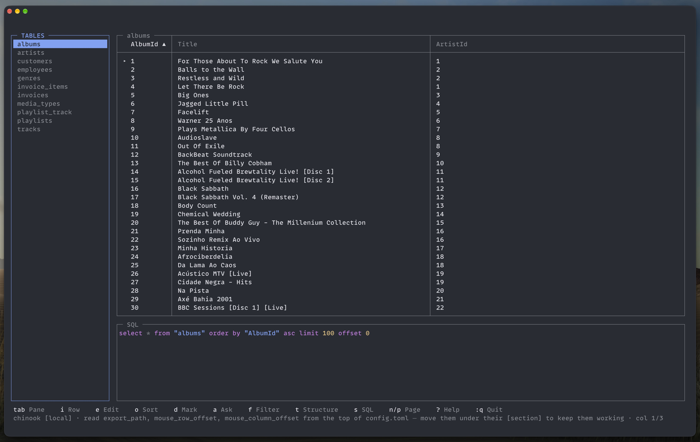

# tql



A database client for the terminal, built with Laravel Zero, Laravel Prompts and
Laravel MCP.

## Why

The database is the part of the job you cannot see. Everything else is in the
terminal already — the editor, the logs, the deploy — and then the schema is
behind a window you have to go and find, in an application that costs money and
knows nothing about the rest of your work.

tql is that window, in the terminal, and it is built around three things a GUI
tends not to do:

- **It shows you the query.** The SQL pane always holds the statement that
  produced what is on screen. Click a header to sort and the `order by` appears.
  Filter a column and the `where` appears, with its value bound, never glued in.
  You learn the language by using the tool.
- **It is the same engine for you and for an agent.** The MCP server and the
  interface both call one `QueryRunner`, so what your agent can see is what you
  can see. The agent's side only reads, and every statement either of you runs
  lands in one shared history.
- **It makes production look like production.** A connection carries a tag and
  the tag carries a color, so the screen tells you where you are before you
  press `d`. Read-only connections refuse every write. Edits and deletions are
  pending until you type `:w`.

It is one binary, no configuration required to start, and it opens a SQLite file
as happily as a Postgres server behind an SSH tunnel.

## Installing

```bash
curl -fsSL https://raw.githubusercontent.com/VheissuLabs/tql/main/install.sh | sh
```

One file, no runtime to install — **tql does not need PHP on your machine**.
The binary carries its own, statically linked, with the three database drivers
built in.

The installer picks the build for your platform, puts it somewhere on your PATH
— `/usr/local/bin` if it can write there, `~/.local/bin` if not — and tells you
where it went. `TQL_BIN_DIR` chooses the directory, `TQL_VERSION=v0.3.0` pins a
version. If you would rather read a script before running it, and you should,
[it is here](install.sh).

By hand: the releases carry `tql-linux-x86_64`, `tql-linux-aarch64`,
`tql-macos-aarch64` and `tql-macos-x86_64`.

```bash
curl -L -o tql https://github.com/VheissuLabs/tql/releases/latest/download/tql-macos-aarch64
chmod +x tql && mv tql /usr/local/bin/
```

On first run tql creates `~/.config/tql/` and migrates its own store, so there
is nothing to set up.

### Packages

Every release also carries a `.deb` and an `.rpm` per architecture, and neither
depends on anything:

```bash
sudo dpkg -i tql_0.3.0_amd64.deb          # debian, ubuntu
sudo dnf install ./tql-0.3.0.x86_64.rpm   # fedora, rhel
```

Homebrew and the AUR are packaged from this repository too — see
[docs/packaging.md](docs/packaging.md).

### With PHP, if you would rather

`tql.phar` is on every release as well, for a machine that already has PHP 8.4
and would rather have a 22MB file than a 35MB one:

```bash
php tql.phar
```

Building it yourself:

```bash
php -d phar.readonly=0 tql app:build tql --build-version=dev
./builds/tql --version
```

Tagging `v*` builds and publishes everything above from GitHub Actions.

## The commands

Running `tql` with nothing after it opens the connection list, which is how you
will use it nearly all the time. The rest are for the things a full-screen
interface is the wrong shape for.

| Command | What it does |
| --- | --- |
| `tql` | the interface: pick a connection and browse |
| `tql open <path-or-dsn>` | open a database by path or connection string, saving it |
| `tql export [connection] [table]` | write rows out as re-importable SQL |
| `tql config` | where the config file is; `--tidy` puts it back in order |
| `tql mcp:start tql` | run the MCP server on stdio, for an agent |

```bash
tql open ~/Code/app/database/database.sqlite
tql open "mysql://root@127.0.0.1:3306/shop" --name="Shop" --tag=local
tql open "$DATABASE_URL" --peek          # use it without saving it
```

`open` takes a SQLite path or a `mysql://`, `pgsql://` or `sqlsrv://` string,
remembers it under `--name` or the database name, and drops you straight into
it. `--tag` is what the connection *is* — `production`, `staging`, `dev` or
`local` — and decides the color it wears. See
[Tags and read only](#tags-and-read-only).

`export` asks for whatever you leave out — connection, database, table and where
to save — so `tql export` on its own is a four-question wizard, and
`tql export prod orders --sql=./orders.sql` is a script. See
[Exporting](#exporting).

`tql list` shows those and nothing else in a released binary — the framework's
own commands are hidden, since tql runs its migrations for itself and a
`migrate:fresh` typed at the wrong moment would drop your saved connections. A
source checkout also shows the development ones, `app:build` and `test`.

## Configuring

There is nothing to configure to start. On first run tql writes
`~/.config/tql/config.toml` with every setting at its default and a comment
above each one, so the file is its own documentation. When a later version adds
a setting it is appended to your file on the next run — your values and your own
comments are left alone — and the status line tells you which ones arrived.

Defaults live in `config/tql.php` and the file is merged over them, so a setting
you never touch follows the application rather than freezing at the value it had
the day you installed it. A file that cannot be parsed does not stop tql: it
starts on the defaults and says so in the status line.

Everything belongs to a section. A key above the first `[section]` is read as a
key of no section and quietly does nothing, which is a mistake worth knowing
about — tql notices and tells you.

[docs/configuration.md](docs/configuration.md) is the same list with more said
about each one.

### `[ui]`

| Key | Default | Meaning |
| --- | --- | --- |
| `sql_position` | `"top"` | where the SQL editor sits: `"top"` or `"bottom"` |
| `sql_always` | `false` | keep the SQL editor on screen instead of only after `s` |
| `sql_height` | `0` | rows it takes, 0 picks a third of the frame |
| `row_style` | `"marker"` | how the current row is shown: `marker`, `dim-others`, `bold`, `inverse`, `underline` |
| `top_margin` | `1` | blank rows above the frame |
| `sidebar_width` | `24` | width of the tables pane |
| `modal_ring` | `true` | ring a modal with a border as well as the box itself |
| `inspect_related` | `10` | related rows to load into the row inspector, 0 turns it off |
| `export_path` | `""` | where exports go, empty uses the last folder you saved one in |
| `mouse` | `true` | click, drag and scroll inside tql |
| `double_click_ms` | `400` | how close two clicks must be to open the editor |
| `mouse_row_offset` | `0` | subtract this from reported mouse rows |
| `mouse_column_offset` | `0` | subtract this from reported mouse columns |

`mouse_row_offset = 1` is the one to reach for inside a multiplexer whose tab
bar sits above the pane: without it every click lands a row out.

### `[theme]`

Colors are names, not hexes — `dim`, `default`, `black`, `red`, `green`,
`yellow`, `blue`, `magenta`, `cyan`, `white`, `gray` — so tql wears the palette
your terminal is already themed with.

| Key | Default | Meaning |
| --- | --- | --- |
| `border` | `"dim"` | a pane border that is not focused |
| `focus_border` | `"cyan"` | the border of the pane you are in |
| `focus_title` | `"cyan"` | its title |
| `grid` | `"dim"` | column separators and the rule under the header |
| `cursor` | `"default"` | the block you are on |
| `selection` | `"default"` | highlighted but not where you are |
| `edited` | `"yellow"` | a row you have changed, before `:w` |
| `deleted` | `"red"` | a row marked for deletion, before `:w` |
| `modal_border` | `"gray"` | modal borders, and the ring around them |
| `modal_focus_border` | `"cyan"` | the same when focused |
| `modal_title` | `"white"` | modal titles |
| `modal_focus_title` | `"cyan"` | the same when focused |

`grid = "inherit"` ties the grid to the pane border, so a focused table tints
all the way through instead of growing a colored outline.

### `[icons]`

The glyph beside a connection name, by driver. The defaults are Nerd Font
devicons, written as escapes here because they are private-use codepoints that
only a Nerd Font draws — your config file can hold either the escape or the
glyph itself.

```toml
[icons]
mysql = "\uE704"    # nf-dev-mysql
pgsql = "\uE76E"    # nf-dev-postgresql
sqlite = "\uE7C4"   # nf-dev-sqllite
sqlsrv = "\uF1C0"   # nf-fa-database
default = "\uF1C0"  # anything else
```

No Nerd Font? Any character works: `mysql = "M"`, or `""` for nothing at all.

### `[ai]`

What answers when you press `a`. Only table and column names are sent — never
rows. See [Asking for SQL](#asking-for-sql).

| Key | Default | Meaning |
| --- | --- | --- |
| `provider` | `"auto"` | `auto` uses whichever API key is in your environment |
| `model` | `""` | empty picks a sensible default for the provider |
| `timeout` | `60` | seconds to wait for an answer |
| `url` | `""` | an OpenAI-compatible endpoint instead, such as LM Studio |
| `key` | `""` | bearer token for that endpoint, if it wants one |

Tags are deliberately not configurable: `production` is red in your terminal and
in the next person's screenshot. See [Tags and read only](#tags-and-read-only).

## TLS

**SSL mode** on a server connection takes `disable`, `prefer`, `require`,
`verify-ca` or `verify-full`, and reveals the CA, cert and key fields. Managed
databases usually want `require` and a CA certificate. Only `verify-full`
checks the hostname.

## Tags and read only

A connection can carry a **tag**, and the tag decides its color:

| tag | color |
| --- | --- |
| production | red |
| staging | yellow |
| dev | blue |
| local | green |

The tag colors the driver icon and the tag itself in the connection list, and
the connection name in the status line while you are in it — so the screen
tells you where you are before you press `d`.

It is a fixed set rather than a configurable one, on purpose: the point of a
tag is that production looks the same in your terminal and in someone else's
screenshot.

**Read only** refuses every write on that connection: no edits, no marks, no
`:w`.

## Several databases on one server

MySQL, Postgres and SQL Server connections are a server, not a single database.
Press **`b`** to list the databases on that server and switch to one; the tables
pane titles itself with the database you are in.

Leave the **Database** field empty on a server connection and tql asks on
connect, opening the list as soon as it is in.

The switch lasts for the session only — it is never written back to the saved
connection, so the connection still opens on its own database next time. It
also drops the current filter, sort and any pending edits, since none of them
mean anything in another database.

A SQLite connection is one file, so `b` says as much and does nothing.

## Databases behind SSH

A connection can reach its database through an SSH tunnel. Set **SSH host** on
a mysql, postgres or sqlsrv connection and the rest of the fields appear:

| field | what it is |
| --- | --- |
| SSH host | the machine you can reach, e.g. `bastion.example.com` |
| SSH port | 22 unless you say otherwise |
| SSH user | the user on that machine |
| SSH key | a key file; empty uses your agent and `~/.ssh/config` |
| SSH password | for a bastion that wants one instead of a key |

Press `↵` on **SSH key** and it lists the private keys it found in `~/.ssh`,
so there is no path to remember. The same goes for the SSL certificate fields,
which also look in `~/.postgresql`, `~/.mysql`, `~/certs`, `~/Downloads` and
the current directory. `type a path…` is always the last option.

tql opens `ssh -N -L <free port>:<db host>:<db port>` and points the driver at
that local port, so the database only ever sees a connection from the machine
you tunnelled through.

It shells out to your own `ssh` rather than speaking the protocol, which means
your agent, your keys and your `~/.ssh/config` all apply — including `Host`
aliases and jump hosts. A connection you can already make by typing `ssh prod`
works by putting `prod` in the SSH host field.

The tunnel is opened once per destination and reused. tql waits for the
forwarded port to accept a connection before running anything, so the first
query cannot race the tunnel coming up, and if ssh fails it says what ssh said.

## A database to try it on

The sample database used in development is [Chinook](https://github.com/lerocha/chinook-database),
which is not committed — a database file changes every time you edit a row, and
a repository that reports itself modified after every demo is no use.

```bash
curl -L -o chinook.db https://github.com/lerocha/chinook-database/raw/master/ChinookDatabase/DataSources/Chinook_Sqlite.sqlite
tql chinook.db
```

## Running it

Running `tql` with nothing after it opens the connection list. To skip it and
open a SQLite file straight away, point tql at the file:

```bash
tql test.sqlite          # same as: tql open test.sqlite
tql ~/Sites/app/db.sqlite
tql test.sqlite --name=scratch   # and call it "scratch" in the list
```

A connection string works the same way:

```bash
tql 'mysql://user:pw@db.example.com:3306/shop'
tql 'postgres://user:pw@host/shop?name=Staging'
```

`mysql`, `mariadb`, `pgsql`, `postgres`, `postgresql`, `sqlsrv`, `mssql` and
`sqlite` schemes are understood. The default port is filled in per driver,
credentials are percent-decoded, and `?name=` sets the label shown in the
title bar.

Anything you open is **remembered**, so you only ever paste a connection string
once. `--name=` names it in the list; without one it is named after the file, or
`database on host`. `--peek` opens without remembering, for a database you are
only glancing at. Re-opening somewhere you already have saved reuses that
connection rather than making a second, and `--name=` on it is a rename. Names
are unique, so a second `database.sqlite` becomes `database.sqlite (2)`.

**A connection string on the command line goes into your shell history.** Paste
it once, then use the connection list, where the password is encrypted at rest.
Prefixing the command with a space keeps it out of history in zsh if
`HIST_IGNORE_SPACE` is set.

A first argument that exists on disk, contains a `/`, ends in `.sqlite`,
`.sqlite3` or `.db`, or looks like a connection string is treated as a path
rather than a command name — a file that exists is never a command name, which
makes the rewrite unambiguous. On first run tql creates `~/.config/tql/`
containing `tql.sqlite` (connections and query history) and `key` (the
encryption key), both `0600`.

## Keys

| Key | Action |
| --- | --- |
| `tab` | switch between the table list and the grid |
| `↑ ↓` / `j k` | move the cursor |
| `← →` / `h l` | move between columns |
| `↵` | open a table, or edit the selected cell |
| `i` | view the selected value full screen, read-only |
| `e` | edit the selected value, `ctrl+s` saves |
| `< >` | narrow or widen the selected column |
| `=` | reset the column width |
| `n` / `p` | next or previous page (100 rows) |
| `r` | reload the current table |
| `o` | sort by the column the cursor is on |
| `N` | add a row |
| `y` / `Y` | yank this value, or the whole row as an object |
| `d` / `u` | mark the row for deletion, or clear every mark |
| `L` | follow a link, `esc` comes back |
| `b` | switch database on this server |
| `s` | open the SQL editor |
| `:` | command line — `:q`, `:tables`, `:rows`, `:reload`, `:sql` |
| `q` / `esc` | quit |

[docs/keys.md](docs/keys.md) has the rest: the filter form, the inspector, the
SQL editor, the lists, the connection form, the command line — and how to
rebind any of it with `[keys]` in the config, which help and the hotkey bar
follow.

Mouse works too: click a table or a row, scroll with the wheel, and **drag a
column border in the header row to resize it**, as you would in a spreadsheet.

Column widths you set are remembered per column name, so several columns keep
their sizes at once and survive paging and switching tables.

## Structure

`t` shows the table's structure: every column with its type, which one is the
primary key, which are foreign keys and where they point, what is not null,
what auto-increments, and the defaults — then the indexes.

```
STRUCTURE  ·  albums

  AlbumId    integer    primary key  ·  not null  ·  auto
  Title      text       not null
  ArtistId   integer    → artists.ArtistId  ·  not null

  indexes
    IFK_AlbumArtistId  (ArtistId)
```

`j`/`k` scroll it, `t`, `q` or `esc` close it.

## Following a link

While the cursor is on a foreign key, the status line says where it goes:
`L → artists`.

With the cursor on a foreign key, `L` opens the table it points at, filtered to
the row it points to. From anywhere else on the row, `L` goes the other way:
the tables that reference this one. If more than one does, it offers a list.

`esc` goes back where you came from, and so does `ctrl+o` if vim's jumplist is
in your fingers. The stack is as deep as you followed, so a chain of links
unwinds one step at a time.

The jump is an ordinary filter, so the SQL pane shows the `where` clause that
made it — following a link teaches you the query you would have written.

## Filtering rows

`f` opens a filter bar, TablePlus style: a column, an operator and a value.

```
┌─ FILTER ───────────────────────────────────────────────────────────┐
│                                                                    │
│  where  city              is               Toronto                 │
│  and    age               is at least      18                      │
│                                                                    │
│  ← → changes it    ↑↓ moves    + adds    - removes    ctrl+s applies│
└────────────────────────────────────────────────────────────────────┘
```

`f` opens on the column you are on, with `contains`, already typing — the
column and operator are guesses, the value never is. `↵` keeps the value and
`↵` again applies it; `esc` steps back into the form to move around.

`tab` and `shift+tab` move between the three cells. On the column or operator,
`↵` opens a type-to-filter list — start typing to narrow it, arrows to move, `↵` to pick —
and `← →` step through the options without opening it. On the value, `↵` types.
`+` and `-` add and remove conditions, `o` switches the whole bar between `and`
and `or`, `ctrl+s` applies and `esc` clears.

The list behaves like Laravel Prompts' `search`, but it is drawn inside the
frame: Prompts' own `select` and `search` block the loop and render a frame of
their own, so using one would mean leaving the TUI and flashing the screen.

Operators: is, is not, contains, starts with, ends with, is greater than, is at
least, is less than, is at most, is empty, is not empty, is one of (a
comma-separated list).

The filter becomes a `where` clause on the query, so the SQL pane shows exactly
what ran — which is the point. **Values are bound, never interpolated**, so a
value containing a quote is a value rather than SQL. The pane shows the
statement with the values filled in for reading; that form is never sent to the
database.

Filters are dropped when you change table, since a column that exists in one
table usually does not in another.

## Sorting

Click a column header, or press `o` on a column, to sort by it: first click
ascending, second descending, third clears it. The header shows `▲` or `▼`, and
the `order by` appears in the SQL pane — so the sort teaches the clause that
produced it.

Sorting applies to a table, not to query results; those are ordered by whatever
your query says.

## Seeing the query behind the view

With `ui.sql_always` on, the SQL pane shows the statement that produced what you
are looking at, and updates as you change table or page:

```
┌─ SQL ────────────────────────────────────────────┐
│ select * from "tracks" limit 100 offset 100      │
└──────────────────────────────────────────────────┘
```

Press `s` and that statement is handed to you to edit — change the `limit`, add
a `where`, press `ctrl+r`, and the grid shows your version.

The pane always mirrors what you are looking at: change table, sort, or page and
it rewrites itself to the query that produced the rows on screen, discarding an
edit you never ran. While you are typing in it, nothing overwrites you.

## Asking for SQL

Press `a` and ask in plain english. The answer lands **in the editor**, with the
explanation as `--` comments above it, and nothing runs until you press
`ctrl+r`.

```
-- Counts how many invoices each customer has. The join matches each invoice to
-- its customer on customer_id, group by makes count() run per customer, and
-- order by puts the busiest first.
--
select c.name, count(i.id) as invoices
from customers c
join invoices i on i.customer_id = c.id
group by c.id, c.name
order by invoices desc
limit 50
```

The model writes queries; it never runs them. It is asked for exactly one
statement, reads only, and is told to use nothing outside the schema — and it
still lands in front of you for review rather than in front of your database.

**Only table and column names are sent.** No row data ever leaves the machine,
so asking about a production table does not send its contents anywhere. The
table you are looking at is sent first so it survives the size limit.

Press `a` and a modal opens with a text area. `↵` asks, `⇧↵` starts a new line,
`esc` cancels. `ctrl+s` sends it too.

Terminals send the same byte for enter and shift+enter, so shift+enter only
arrives as its own key when the terminal is told to send one. In Ghostty:

```
keybind = shift+enter=csi:13;2u
```

Alt+enter works without any configuration, if you would rather not set that.

## Which model answers

Whatever you have a key for. `provider = "auto"` picks the first provider the
AI SDK finds a key for, so setting `ANTHROPIC_API_KEY` or `OPENAI_API_KEY` is
all it takes:

```toml
[ai]
provider = "auto"   # or anthropic, openai, gemini, groq, mistral, deepseek, xai, openrouter, ollama
model = ""          # empty uses a sensible default for that provider
timeout = 60
```

### A local model, with LM Studio

Anything with an OpenAI-compatible API works. LM Studio, start to finish:

1. Install a model in LM Studio — a coding model is the right shape for this;
   `qwen2.5-coder-7b-instruct` is a good starting point.
2. Open the **Developer** tab and **Start Server**. It listens on port 1234 by
   default and speaks OpenAI's API at `http://localhost:1234/v1`.
3. Ask it what it is serving, and use that name verbatim:

   ```bash
   curl -s http://localhost:1234/v1/models | jq -r '.data[].id'
   # qwen2.5-coder-7b-instruct
   ```

4. Put both in `~/.config/tql/config.toml`:

   ```toml
   [ai]
   url = "http://localhost:1234/v1"
   model = "qwen2.5-coder-7b-instruct"
   key = ""            # LM Studio does not want one; some gateways do
   ```

5. Press `a` in tql and ask for something.

`provider` is ignored once `url` is set — a url points somewhere deliberate, so
it wins over any key in your environment. Nothing leaves your machine in that
setup, and only table and column names were ever being sent anyway.

Ollama is the same shape, on its own port:

```toml
[ai]
url = "http://localhost:11434/v1"
model = "qwen2.5-coder"
```

LM Studio may want a token — it says so in the Developer tab, and it goes in
`key`. A url with no path gets `/v1` added, so `http://localhost:1234` and
`http://localhost:1234/v1` both work.

A reasoning model such as qwen3 answers in its thinking rather than in the
message body, and tql reads the answer out of it either way.

If `a` says nothing is configured, tql could not find a url or a key. If it
fails at the network, the server is not running or the port is wrong — the
`curl` above is the quickest way to tell which.

With nothing configured at all, `a` says what to set rather than failing at the
network.

## Enter runs things

Everywhere you type something that then has to happen — a query, a value, a
filter, a question — `↵` does it and `⇧↵` adds a line. `ctrl+r` and `ctrl+s`
still work if they are in your fingers.

Shift+enter needs a terminal that sends something distinct for it. In Ghostty:

```
keybind = shift+enter=csi:13;2u
```

Alt+enter works without any configuration.

## Running SQL

The SQL pane is syntax highlighted — keywords, quoted identifiers, strings,
numbers and comments each colored, the same tokeniser approach as the JSON
viewer and equally careful never to drop a character while you type.


Press `s` (or `:sql`) for the SQL editor, which opens above the results.
`ctrl+r` runs what you have typed, `esc` returns to browsing. Results replace
the grid and are read-only, since they have no primary key to write back
through — open a table to edit.

## JSON columns

A cell holding JSON opens in a full-width modal when you press `i`: pretty
printed, with line numbers and syntax highlighting — keys, strings, numbers and
literals each colored. `↑↓` scrolls a line at a time, `n`/`p` a page, `esc`
closes.

Detection is by parsing, not by column type, so JSON stored in a `text` column
is recognised too.

## Inspecting a row

`i` floats two boxes over the grid: the record itself, and the records related
to it. Folding a box collapses it to its title bar, so the shape of the modal
tells you what is open, and the table stays visible behind.

```
┌─ RECORD  (3) ───────────────────────────────────────────────┐
│  AlbumId      1                                     integer │
│  Title        For Those About To Rock We Salute     text    │
│  ArtistId     1                                     integer │
└─────────────────────────────────────────────────────────────┘

┌─ RELATED  (2) ──────────────────────────────────────────────┐
│  ▾ artists  (1)                                             │
│      ArtistId  Name                                         │
│      1         AC/DC                                        │
│  ▸ tracks  (10 of 47)                                       │
└─────────────────────────────────────────────────────────────┘
```

Column, value, then the type as an annotation. Related records stay as
collections: one header for the relation, then a line per record.

`↵` or `space` folds whichever box or relation the cursor is on. `j`/`k` move,
`g`/`G` jump, `V` selects, `y` yanks, `esc` closes. `e` on a field opens the
editor on **that** column, not whichever one the grid cursor was on.

Each relation says what it is: **belongs to** when this row holds the key,
**has many** for the rows pointing back, and **has one** when a unique key on
the other side means there can only be one. A single record reads as fields; a
list reads as a table.

A **join table is read through**, not shown: a film's `film_actor` rows are a
list of timestamps, so tql shows `actors · has many through film_actor` with
the actors in it. A join table that carries data of its own — a quantity, a
price — is a table in its own right and is shown as one.

Every column of a related row is shown, laid out to the width you actually have:
the columns that already fit are left alone and what is left over is shared
between the ones that do not, with an `…` where a value was cut. Nothing is
dropped, so the row you are reading is the row that is there, and `i` on the row
in its own table opens the whole of it. Widen the terminal and the columns widen
with it.

Relations are found by following foreign keys both ways.
`ui.inspect_related` caps how many rows are loaded (10 by default, 0 turns it
off); when there are more, the heading says `(10 of 47)`.

`I` opens just the value under the cursor, for a single enormous blob.


## Exporting

From the command line, which is the scriptable way:

```bash
tql export                           # asks which connection, then which table
tql export prod orders --limit=1000 --sql=./orders.sql
tql export prod --sql=./prod.sql     # every table, one file
tql export prod --list               # what tables are there
tql export prod --database=shop      # pick the database on a server connection
```

A connection that names a server rather than a database asks which one first,
or takes `--database=`; without either it stops and says so rather than
exporting every schema on the box.

Name a connection and it goes straight through; name nothing and it asks three
questions — which connection (most recently used first), which table (the whole
database is the first answer), and where to save it, offering the auto-named
file in the export directory. Answer that last one with a folder and it names
the file for you; `--sql` skips the question. Piped or with `--no-interaction` it
never asks — it says what it needed and stops with a non-zero exit.

Save one somewhere else — `~/Downloads`, say — and that becomes the folder the
next export is offered in. `ui.export_path` in the config overrides it, and if
the remembered folder is gone tql falls back to its own.

`--sql` takes a file or a directory; omit it and the file is named
automatically in the export directory, after the database, the table and the
time — `karlm_v2-users-20260922-231302.sql`, or `karlm_v2-20260922-231302.sql`
for the whole thing — since the connection's own name says nothing about what is
in the file. `--limit` caps rows per table, which is
how you pull a slice of production rather than all of it.

Inside the interface, `:export` writes what you are looking at to a `.sql` file of `insert`
statements. On a table that is every row, read in chunks so a large table does
not go through memory at once; after a query it is the rows you have loaded.

Files land in `~/.config/tql/exports` (override with `ui.export_path`), named
`connection-table-YYYYMMDD-HHMMSS.sql`. The status line reports the row count,
file size and path.

Data only — no schema. Your migrations own the schema; this is for pulling rows
from one database into another.

## Editing

Select a cell and press `e` or `↵`. `↵` saves, `esc` cancels. An empty value
writes `NULL`.

Editing requires a single-column primary key, which tql uses to target the
row. Tables without one are read-only, as are connections flagged `read_only`.

## Connections

The first screen lists your saved connections.

| key | what it does |
| --- | --- |
| `↵` | open it |
| `e` | edit it in place |
| `n` | add one |
| `d` | mark it for deletion |
| `u` | clear every mark |
| `:w` | write the marked deletions |

Adding and editing happen in a modal over the list, never by dropping out to a
prompt sequence. `↑↓` picks a field, `↵` edits it with a real cursor (arrows,
home, end, backspace, delete, paste), `ctrl+s` saves and `esc` cancels. Nothing
is written until you save. The driver is cycled with `← →` and only offers
drivers your PHP build actually has.

## Adding a row

`N` puts an empty row on top of the grid, where you are already looking rather
than a hundred rows down. It is a row like any other — `e`
fills a column, `↵` keeps it — except that it is not in the table yet, so it is
drawn in the added colour and nothing has happened until `:w`.

A column you never touch is left out of the insert, so the table's own default
applies: add a row to `widgets (id, name, qty default 1)`, type a name, write
it, and the id and the quantity come from the database rather than from tql.
Blank is how that reads on screen — an untouched column is empty, not `NULL`,
because what it ends up holding is the table's business.

### The time

Any date, time or timestamp column takes **`ctrl+t`** while editing: it types
the current time into the editor, in the format that column wants — `Y-m-d` for
a date, `H:i:s` for a time, `Y-m-d H:i:s` for a datetime or timestamp — so you
can see it before keeping it. The status line says so while you are in one.

Typing **`now()`** does the same thing without the shortcut, wherever it is
typed, since an explicit `now()` is an instruction rather than a value. That is
how `created_at` and `updated_at` get filled in without looking up a format.

It writes **UTC**, because that is what a database column almost always holds
and a row written in local time is wrong in a way nobody notices for months.
The status line names the zone — `ctrl+t now UTC` — and `[ui] time_zone` in the
config changes it:

```toml
[ui]
time_zone = "America/Toronto"
```

`u` drops it, a reload keeps it, and changing table forgets it. It works on a
table with no primary key, which editing does not: a row that is not in the
table yet is written by position rather than by key.

## When something goes wrong

A database refusing a write is the most important thing on the screen, so it
takes the screen: the error opens as a modal over whatever you were doing, with
the statement it refused on its own line and what to do next under it.

```
┌─ COULD NOT ADD THE ROW ──────────────────────────────────────┐
│                                                              │
│  SQLSTATE[23000]: Integrity constraint violation: 19 UNIQUE  │
│  constraint failed: people.email                             │
│                                                              │
│  insert into "people" ("name", "email") values (…)           │
│                                                              │
│  The row is still here — fix it and :w again, or u to drop.  │
│                                                              │
│  y copies it    esc closes                                   │
└──────────────────────────────────────────────────────────────┘
```

The connection name tql invented and the file it opened are taken out — that is
tql talking to itself, not the database talking to you. `j`/`k` scroll a long
one, `y` copies it, any other key closes it. **Your pending changes are still
pending**: nothing is dropped because a write failed.

## Pending changes

Nothing you do to a row reaches the database until you ask for it.

| key | what it does |
| --- | --- |
| `e` | edit the value; `ctrl+s` keeps the edit, pending |
| double click | the same, with the mouse |
| `d` | mark the row for deletion, and move down |
| `u` | drop every pending change |
| `:w` | write them all |

Edited rows are highlighted in `theme.edited` (yellow) and show the value you
typed rather than what is still on disk. Rows marked for deletion are
highlighted in `theme.deleted` (red). The status line counts both.

Changes are keyed by primary key, so sorting, filtering or reloading keeps them
on the rows you picked, and they are dropped when you change table — a mark
means nothing in a table where that id is a different row. Quitting with
unwritten changes drops them and says so; `:q` again leaves.

## Deleting

`d` marks the row under the cursor and moves down, so a run of rows is `ddd`.
Nothing is written yet: marked rows are highlighted in `theme.deleted` (red by
default), `d` again unmarks, and `u` clears every mark.

`:w` writes them, all in one transaction. Until then the database is untouched.

Marks follow the row, not its position, so sorting or reloading keeps them on
the rows you picked. Quitting with unwritten marks drops them and tells you,
rather than either losing them silently or writing something you did not ask
for — press `:q` again to leave.

A table with no single-column primary key cannot be deleted from, because there
is no safe way to name the row; it says so rather than guessing.

## MCP

The MCP server is registered as a local (stdio) server named `tql`:

```bash
php tql mcp:start tql
```

To use it from Claude Code:

```bash
claude mcp add tql -- php /absolute/path/to/tql mcp:start tql
```

Tools: list connections, list tables, describe a table, and run a query.
Queries through MCP are **read-only** — only `select`, `show`, `explain`,
`describe`, `pragma` and `with` are accepted, and statements containing a
second statement are rejected. Writes happen in the interface, not through
an agent.

## Developing

```bash
composer install
php tql
./vendor/bin/pest
```

The interface is composed of **islands**: bordered boxes that own a rectangle,
draw their own content and answer hit tests for it. `Screen` places them and
composes the frame row by row. Adding a pane means adding an island.

[docs/developing.md](docs/developing.md) has the rest: where everything lives,
how a frame is drawn, the drawing rules that are easy to break, how to add a
key, a modal, a command, an MCP tool or a setting, how the interface is tested
without a terminal, and the notes on Laravel Zero, Prompts and MCP that this
project ran into.

[docs/configuration.md](docs/configuration.md) is every setting, and
[docs/keys.md](docs/keys.md) is every key.
[docs/packaging.md](docs/packaging.md) covers the binary, the `.deb` and the
`.rpm`, the Homebrew tap and the AUR package.

Connection passwords and SSH passwords are encrypted with Laravel's encrypter
using a key at `~/.config/tql/key`, `0600`. Filter values are always bound,
never interpolated — the SQL pane shows them filled in for reading, and that
string is never what runs.
